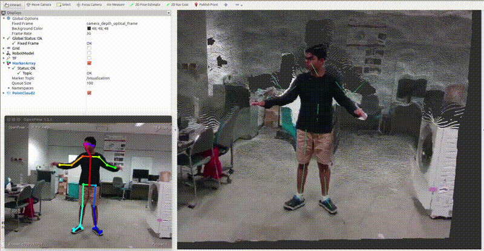

# ros_openpose

ROS wrapper for OpenPose | It supports *(currently but others are planned)*-

- [x] Intel RealSense Camera :heavy_check_mark:
- [x] Microsoft Kinect v2 Camera :heavy_check_mark:
- [x] Stereolabs ZED2 Camera :heavy_check_mark: (see [thanks](#thanks) section)
- [x] Azure Kinect Camera :heavy_check_mark:
- [x] Any color camera such as webcam etc :heavy_check_mark:

</br>

<p align="center">
    
    </br>
    <sup>Sample video showing visualization on RViz</sup>
</p>


## Supported OpenPose Versions
* 1.7.0 *latest* (see point #1 in [troubleshooting](#troubleshooting) section)
* 1.6.0 (see [thanks](#thanks) section)
* 1.5.1
* 1.5.0


## Dependencies
* [OpenPose](https://github.com/CMU-Perceptual-Computing-Lab/openpose)


Note: Additionally, camera-specific ROS drivers such as following are required as per your camera model-
* [realsense-ros](https://github.com/IntelRealSense/realsense-ros): For Intel RealSense Camera
* [iai_kinect2](https://github.com/code-iai/iai_kinect2): For Microsoft Kinect v2 Camera
* [zed-ros-wrapper](https://github.com/stereolabs/zed-ros-wrapper): For Stereolabs ZED2 Camera
* [azure_kinect_ros_driver](https://github.com/microsoft/Azure_Kinect_ROS_Driver): For Azure Kinect Camera


## Installation
1. Make sure to download the complete repository. Use `git clone https://github.com/ravijo/ros_openpose.git` or download zip as per your convenience.
1. Invoke catkin tool inside ros workspace i.e., `catkin_make`
1. Make python scripts executable by using command below-
```bash
roscd ros_openpose/scripts
chmod +x *.py
```


## Troubleshooting
1. While compiling the package, if the following error is reported at the terminal-
    ```
    error: no matching function for call to ‘op::WrapperStructPose::WrapperStructPose(<brace-enclosed initializer list>)’
    ```
    In this case, please checkout OpenPose version 1.7.0 by running the following command at the root directory of OpenPose installation-
    ```bash
    git checkout tags/v1.7.0
    ```
1. While compiling the package, if any of the following error is reported at the terminal-
    ```
    error: ‘check’ is not a member of ‘op’

    error: no match for ‘operator=’ (operand types are ‘op::Matrix’ and ‘const cv::Mat’)

    error: invalid initialization of reference of type ‘const op::String&’ from expression of type ‘fLS::clstring {aka std::__cxx11::basic_string<char>}’
    ```
    In this case, please checkout OpenPose version 1.6.0 by running the following command at the root directory of OpenPose installation-
    ```bash
    git checkout tags/v1.6.0
    ```
    Do not forget to run `sudo make install` to install the OpenPose system-wide.
1. If compliation fails by showing the following error-
    ```
    /usr/bin/ld: cannot find -lThreads::Threads
    ```
    In this case, please put the following by editing the [CMakeLists.txt](https://github.com/ravijo/ros_openpose/blob/master/CMakeLists.txt)
    ```
    find_package(Threads REQUIRED)
    ```
    For more information, please check [here](https://github.com/ravijo/ros_openpose/issues/12).
1. <s>While compiling the package, if the following error is reported at the terminal-
    ```
    error: no match for ‘operator=’ (operand types are ‘op::Matrix’ and ‘const cv::Mat’)
    ```
    In this case, please update the OpenPose. Most likely, an old version of OpenPose is installed. So please checkout Openpose from the master branch as [described here](https://github.com/CMU-Perceptual-Computing-Lab/openpose/blob/master/doc/installation.md#update-openpose). Alternatively, you can checkout OpenPose version 1.5.1 by running the following command at the root directory of OpenPose installation-
    ```bash
    git checkout tags/v1.5.1
    ```
    Do not forget to run `sudo make install` to install the OpenPose system-wide.</s> *Note that OpenPose version 1.5.1 is still supported.*
    
    
## Configuration
The main launch file is `run.launch`. It has the following important arguments-
1. `model_folder`: It represents the full path to the model directory of OpenPose. Kindly modify it as per OpenPose installation in your machine. Please edit `run.launch` file as shown below-
    ```xml
    <arg name="openpose_args" value="--model_folder /home/ravi/openpose/models/"/>
    ```
1. `openpose_args`: It is provided to support the standard OpenPose command-line arguments. Please edit `run.launch` file as shown below-
    ```xml
    <arg name="openpose_args" value="--face --hand"/>
    ```
1. `camera`: It can only be one of the following: `realsense`, `kinect`, `zed2`, `nodepth`. Default value of this argument is `realsense`. See below for more information.


## Implementation Versions Info.
* **Synchronous API**  (see [thanks](#thanks) section)
  * Uses `op_wrapper.emplaceAndPop()` method provided by OpenPose
  * By default this version is disabled. Therefore, please set `synchronous:=true` and provide `py_openpose_path` while calling `run.launch`. For example:
    ```bash
    roslaunch ros_openpose run.launch camera:=realsense synchronous:=true py_openpose_path:=absolute_path_to_py_openpose
    ```
  * If the arg `py_openpose_path` is not specified, then the CPP node is used. Otherwise, the python node is used. Therefore, please compile OpenPose accordingly if you plan to use python bindings of the OpenPose.

* **Asynchronous API**
  * Uses two workers, `op::WorkerProducer` and `op::WorkerConsumer` workers provided by OpenPose
  * Uses OpenPose CPP APIs
  * By default this version is enabled. Users are advised to try `synchronous:=true` if not satisfied with the performance.


## Steps to Run with Intel RealSense Camera
1. Make sure that ROS env is sourced properly by executing the following command-
    ```bash
    source devel/setup.bash
    ```
1. Invoke the main launch file by executing the following command-
    ```bash
    roslaunch ros_openpose run.launch
    ```


## Steps to Run with Microsoft Kinect v2 Camera
1. Make sure that ROS env is sourced properly by executing the following command-
    ```bash
    source devel/setup.bash
    ```
1. Invoke the main launch file by executing the following command-
    ```bash
    roslaunch ros_openpose run.launch camera:=kinect
    ```


## Steps to Run with Stereolabs ZED2 Camera
1. Change the parameter `openni_depth_mode` in [zed-ros-wrapper/zed_wrapper/params/common.yaml](https://github.com/stereolabs/zed-ros-wrapper/blob/master/zed_wrapper/params/common.yaml) to `true` (default is `0`).
1. Make sure that ROS env is sourced properly by executing the following command-
    ```bash
    source devel/setup.bash
    ```
1. Invoke the main launch file by executing the following command-
    ```bash
    roslaunch ros_openpose run.launch camera:=zed2
    ```


## Steps to Run with Azure Kinect Camera
1. Make sure that ROS env is sourced properly by executing the following command-
    ```bash
    source devel/setup.bash
    ```
1. Invoke the main launch file by executing the following command-
    ```bash
    roslaunch ros_openpose run.launch camera:=azurekinect
    ```


## Steps to Run with any Color Camera such as Webcam etc.
1. Make sure that ROS env is sourced properly by executing the following command-
    ```bash
    source devel/setup.bash
    ```
1. Start the ROS package of your camera. Basically, this package is going to capture images from your camera, and then it is going to publish those images on a ROS topic. Make sure to set the correct ROS topic to `color_topic` inside [config_nodepth.launch](https://github.com/ravijo/ros_openpose/blob/d5d8e05978a1b085d8d6ffdc7604dc99a664d8d8/launch/config_nodepth.launch#L10) file.
1. Invoke the main launch file by executing the following command-
    ```bash
    roslaunch ros_openpose run.launch camera:=nodepth
    ```

Note: To confirm that ROS package of your camera is working properly, please check if the ROS package is publishing images by executing the following command-
```bash
rosrun image_view image_view image:=YOUR_ROSTOPIC
```
Here `YOUR_ROSTOPIC` must have the same value as `color_topic`.


## FAQ
1. **How to add my own depth camera into this wrapper?**

    Go inside `launch` subdirectory and make a copy of `config_realsense.launch` as `config_mycamera.launch`. Make necessary changes to the `color_topic`, `depth_topic`, `cam_info_topic` and `frame_id` arguments. More inforation is given below-
    * Input depth images are aligned to the color images already. 
    * Depth and color images have the same dimension. Therefore, each pixel from the color image can be mapped to corresponding depth pixel at the same x, y location. 
    * The depth images contain depth values in millimeters and represented by `TYPE_16UC1` using OpenCV.
    * The `cam_info_topic` is containing camera calibration parameters supplied by the manufacturer.

    Please check [here](https://github.com/ravijo/ros_openpose/issues/9) for a similar question.

2. **How to run this wrapper with limited resources such as low GPU, RAM, etc.?**

    Below is a brief explanation about the `ros_openpose` package. This package does not use GPU directly. However, it depends on `OpenPose`, which uses GPU heavily. It contains a few ROS subscribers, which copies data from the camera using ROS. Next, it employs two workers, namely input and output workers. The job of the input worker is to provide color images to the `OpenPose`, whereas the role of the output worker is to receive the keypoints detected in 2D (pixel) space. The output worker then converts 2D pixels to 3D coordinates. The input worker waits for 10 milliseconds if the camera provides no new frames, and then it checks again if no new frame is available. If not, then wait for 10 milliseconds, and the cycle continues. In this way, we make sure that the CPU gets some time to sleep (indirectly lowering the CPU usage). 

    * If the CPU usage are high, try increasing the sleep value (`SLEEP_MS`) as defined [here](https://github.com/ravijo/ros_openpose/blob/d101e2550ded3bd8d6dd71e27ff43693f28894ab/src/rosOpenpose.cpp#L26). 
    * Try reducing the `--net_resolution` and by using `--model_pose COCO`. 
    * Try disabling multithreading in OpenPose software simply by supplying `--disable_multi_thread` to `openpose_args` inside `run.launch` file.
    * Another easiest way is to decrease the FPS of your camera. Please try to lower it down as per your limitations.
    
    Please check [here](https://github.com/ravijo/ros_openpose/issues/6) for a similar question.

3. **How to find the version of the OpenPose installed on my machine?**

   Please use the shell script [get_openpose_version.sh](https://github.com/ravijo/ros_openpose/blob/master/get_openpose_version.sh) as shown below-
   ```bash
   sh get_openpose_version.sh
   ```
   You can use `cmake` as well. See [here]( https://github.com/ravijo/ros_openpose/blob/b4598b719e5699eb69f80d917a154e008e935c77/CMakeLists.txt#L37)


## Note
This package has been tested on the following environment configuration-

| Name      | Value                                  |
| ----------| -------------------------------------- |
| OS        | Ubuntu 14.04.6 LTS (64-bit)            |
| RAM       | 16 GB                                  |
| Processor | Intel® Core™ i7-7700 CPU @ 3.60GHz × 8 |
| Kernel    | Version 4.4.0-148-generic              |
| ROS       | Indigo                                 |
| GCC       | Version 5.5.0                          |
| OpenCV    | Version 2.4.8                          |
| OpenPose  | Version 1.5.1                          |
| GPU       | GeForce GTX 1080                       |
| CUDA      | Version 8.0.61                         |
| cuDNN     | Version 5.1.10                         |

## Citation

If you used `ros_openpose` for your work, please cite it.

```tex
@misc{ros_openpose,
    author = {Joshi, Ravi P. and van den Broek, Marike K and Tan, Xiang Zhi and Choi, Andrew and Luo, Rui},
    title = {{ROS OpenPose}},
    year = {2019},
    publisher = {GitHub},
    journal = {GitHub Repository},
    howpublished = {\url{https://github.com/ravijo/ros_openpose}}
}
```

## Issues (or Error Reporting)
Please check [here](https://github.com/ravijo/ros_openpose/issues) and create issues accordingly.


## Thanks
Following authors are sincerely acknowledged for the improvements of this package-
* [Marike Koch van den Broek](https://github.com/ruksen25): For adding support for [Stereolabs ZED2 Camera](https://www.stereolabs.com/zed-2/)
* [Xiang Zhi Tan](https://github.com/xiangzhi): For providing compatibility for OpenPose 1.6
* [Andrew Choi](https://github.com/QuantuMope): For providing synchronous version i.e., `op_wrapper.emplaceAndPop()` support for OpenPose 1.6
* [Rui Luo](https://github.com/luorui93): For fixing a crash in ros_openpose_synchronous.py when nobody or only partial body is visible
* [Booyeon](https://github.com/BrianChoi12): Fixing gflags library issue causing compilation error
